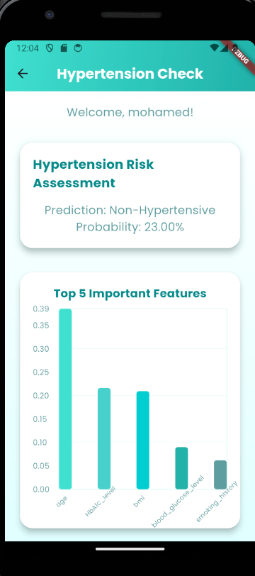
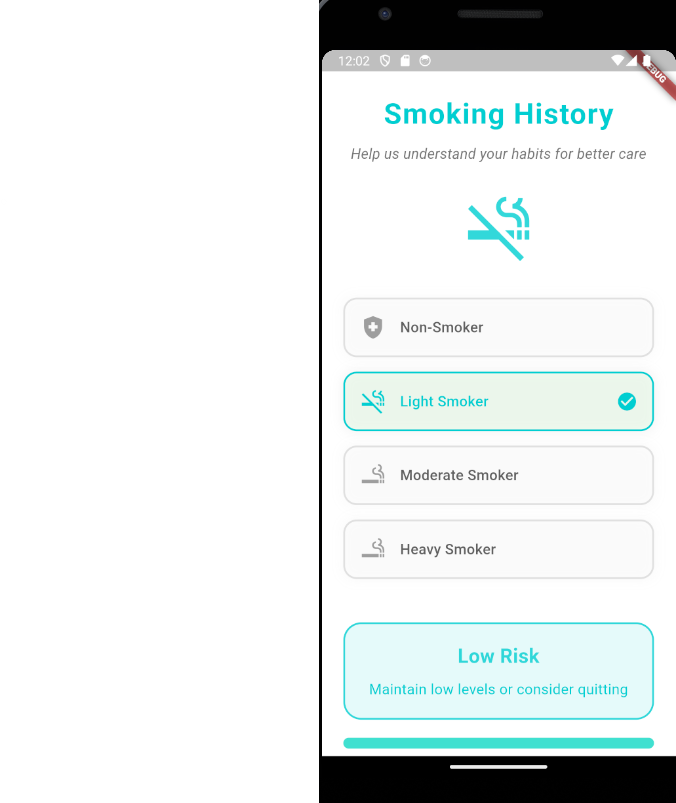

# Random Forest Classification Web App with Flask and Firebase

This project demonstrates a high-performance machine learning pipeline for classification tasks using a **Random Forest** model. The system integrates with a **Flask web API** for model serving and utilizes combined with ngrok to make a local server accesible from everywhere **Firebase Firestore** for remote data storage. It incorporates PCA-based dimensionality reduction and presents explainable outputs such as feature importance and evaluation metrics thanks to random forest interpretability.

---

##  Overview

The pipeline is built to support:

- **Data preprocessing** using `StandardScaler` and PCA for noise reduction and improved model performance.
- A **Random Forest Classifier** for robust, non-linear classification.
- Full **model deployment** using a lightweight Flask API.
- **Firebase integration** for persistent cloud data storage (via Firestore).
- Output of **model metrics** (accuracy, precision, recall, F1 score).
- **Feature importance** analysis and visualization for interpretability.
- Extensibility for frontend integration or containerized environments.

The model currently achieves an **accuracy of 97%** on the test dataset, indicating high performance in real-world scenarios.

---

##  ML Workflow

1. **Data Preprocessing**
   - Handle missing values and encode categorical variables.
   - Scale features with `StandardScaler`.
   - Reduce dimensionality with `PCA`.

2. **Model Training**
   - Trained a `RandomForestClassifier` with cross-validation and hyperparameter tuning (if needed).

3. **Evaluation**
   - `Accuracy`, `Precision`, `Recall`, `F1 Score`, `Confusion Matrix`, and `Classification Report` computed for full diagnostics.

4. **Model Serving**
   - A Flask API accepts JSON input and returns classification results.
   - Firebase Firestore logs predictions and optionally stores user input.
5. **flutter app**
   - a flutter app is presented so the user can enter their data and get the model response

5. **Explainability**
   - Feature importance is extracted and visualized to provide model transparency.

---

## 🧑‍⚕️ Model Parameters

The model accepts the following parameters for prediction:

- **gender**: Categorical variable representing the gender of the individual (e.g., "Male", "Female").
- **age**: Numeric value representing the age of the individual in years.
- **heart_disease_history**: Binary indicator of whether the individual has a history of heart disease (1 = Yes, 0 = No).
- **smoking_history**: Binary indicator of whether the individual has a smoking history (1 = Yes, 0 = No).
- **hba1c_level**: Numeric value representing the HbA1c level (a measure of blood sugar over time).
- **blood_glucose_level**: Numeric value representing the individual's blood glucose level (mg/dL).
- **diabetes**: Binary indicator of whether the individual has diabetes (1 = Yes, 0 = No).

These parameters are used by the model to predict the likelihood of heart disease or other health-related conditions.

---

## Model Metrics

The Random Forest model used in this project has achieved an **accuracy of 92%**. Below are the detailed classification metrics:

|              | Precision | Recall  | F1-Score | Support |
|--------------|-----------|---------|----------|---------|
| **0**        | 0.93      | 0.91    | 0.92     | 26,565  |
| **1**        | 0.91      | 0.93    | 0.92     | 26,646  |

as for accuracy

| **Accuracy** |           |         | 0.92     | 53,211  |
| **Macro avg**| 0.92      | 0.92    | 0.92     | 53,211  |
| **Weighted avg** | 0.92  | 0.92    | 0.92     | 53,211  |

These metrics indicate that the model is well-balanced, performing almost equally for both classes (heart disease/no heart disease) in terms of precision, recall, and F1-score.

---

## 📚 Python Libraries Used

- `pandas`  
- `numpy`  
- `matplotlib`  
- `seaborn`  
- `scikit-learn`  
- `flask`  
- `joblib`  
- `firebase-admin`  
- `os`  
- `warnings`

---

## 📸 Example Visuals

Here are a few key images demonstrating the application and insights provided by the model:

### 1. **Diabetes Entry Page**

This is the user interface page where the user can input relevant data about their **diabetes** history. The model then processes the information to predict health outcomes.

### 2. **Feature Importance with Model Prediction**

The feature importance chart visualizes the significance of each input feature (e.g., age, smoking history, HbA1c level) in predicting the outcome. Higher values indicate features that play a more crucial role in the decision-making process of the Random Forest model.

### 3. **Gender, Height, Weight, and Age Entry Page**

This page collects data on **gender**, **height**, **weight**, and **age** from the user. The model uses this information along with other parameters to predict the likelihood of developing heart disease or other conditions.

### 4. **HbA1c Entry Page**

The user provides their **HbA1c level**, a key indicator of long-term blood glucose control. The model uses this data to assess the risk of diabetes and related conditions.

### 5. **Heart Disease History Entry Page**

This page collects data on the **history of heart disease**. The model predicts the likelihood of a cardiovascular event based on this information.

### 6. **Smoking History Entry Page**

The user inputs their **smoking history**. Smoking is a significant risk factor for many diseases, and this data helps the model predict potential health outcomes.

---

## ⚙️ API

The Flask API exposes endpoints to:
- Accept input data for prediction (`/predict`)

---

## 🔐 Firebase Integration

The app uses `firebase-admin` SDK to:
- Authenticate via service account credentials
- Connect to Firestore database
-

---
